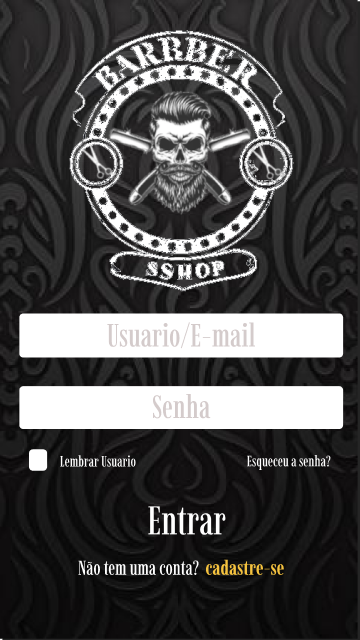
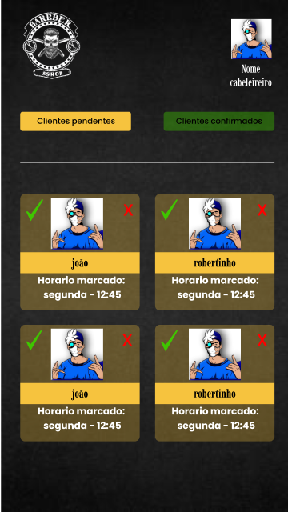
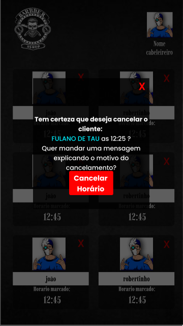

# HairApp

It's an mobile app for managing clients at a hairdresser and scheduling appointments for a haircut. 

### This project was made with some tools like:

- Typescript
- React Native
- Expo
- Styled-Componentes
- Express
- Mongoose
- JWT
- Bcrypt
- Axios

# Some Screens

  
  
  
  
  
  
  
  

