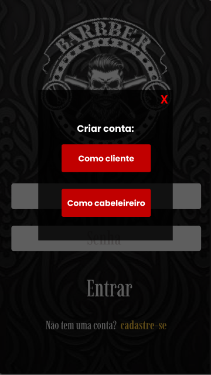
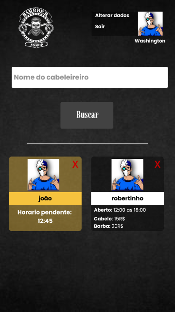
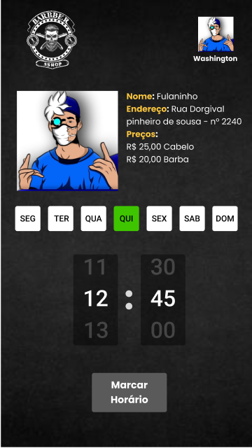
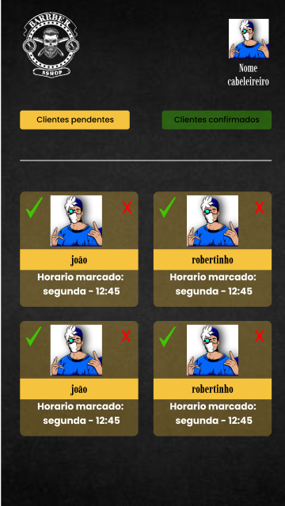
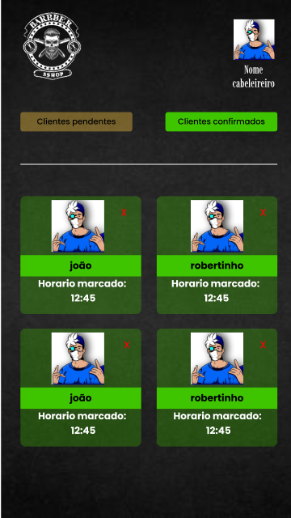
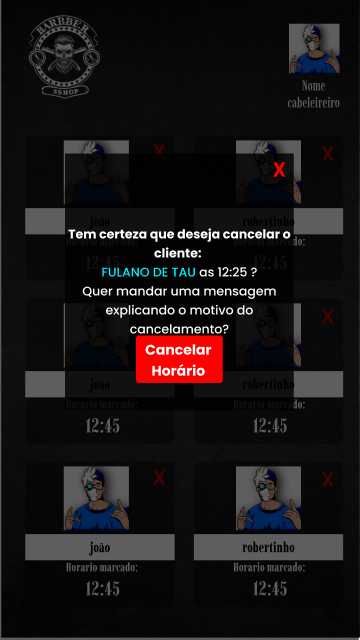

# HairApp

Aplicativo mobile para gestão de clientes e agendamento de horários em barbearias e salões de beleza. O projeto conecta dois perfis de usuário — **cliente** e **cabeleireiro** — por meio de uma API REST, permitindo cadastro, autenticação, montagem de lista de profissionais favoritos e fluxo completo de agendamento com confirmação.

> Demo: [vídeo de apresentação no LinkedIn](https://www.linkedin.com/posts/roger-albuquerque_en-in-the-last-few-days-i-studied-a-lot-activity-7092567040489660416-wVz1/?utm_source=share&utm_medium=member_desktop)


---

## Visão geral

O **HairApp** é um monorepo com duas aplicações independentes:

| Módulo     | Descrição                                                           |
| ---------- | ------------------------------------------------------------------- |
| `backend/` | API REST em Node.js + Express, persistência em MongoDB via Mongoose |
| `mobile/`  | App mobile em React Native com Expo, consumindo a API via Axios     |

O objetivo principal é digitalizar a relação entre cliente e cabeleireiro: 

- O cliente encontra profissionais, adiciona-os à sua lista pessoal e solicita horários; 

- O cabeleireiro visualiza solicitações pendentes, confirma ou cancela agendamentos e gerencia as informações do salão (preços, dias e horários de funcionamento).

O projeto foi desenvolvido como MVP funcional, com foco no fluxo central de agendamento. Algumas telas (como cadastro de cartão de crédito) existem como protótipo visual e ainda não possuem integração com backend.

---

## Funcionalidades

### Autenticação e conta

- Cadastro de **cliente** (nome, e-mail, senha)
- Cadastro de **cabeleireiro** (nome, endereço, e-mail, senha, preços, dias de funcionamento e horário de abertura/fechamento)
- Login unificado por nome de usuário ou e-mail, com retorno de JWT
- Recuperação de senha via e-mail (token temporário de 1 hora)
- Edição de perfil para ambos os perfis

### Cliente

- Buscar cabeleireiro pelo nome exato e adicioná-lo à lista pessoal
- Visualizar cards com informações do profissional (preços, dias de trabalho, horários)
- Agendar horário em um dia da semana dentro do expediente do salão
- Editar ou cancelar o próprio agendamento
- Regra: **apenas um agendamento ativo por cliente**

### Cabeleireiro

- Visualizar lista de clientes agendados, filtrada por status (`PENDING`, `CONFIRMED`)
- Confirmar ou cancelar solicitações de agendamento
- Editar informações do salão (endereço, preços, dias e horários)

### Status de agendamento

| Status      | Significado                                               |
| ----------- | --------------------------------------------------------- |
| `PENDING`   | Cliente solicitou; aguardando confirmação do cabeleireiro |
| `CONFIRMED` | Cabeleireiro confirmou o horário                          |
| `CANCELED`  | Agendamento cancelado por cliente ou cabeleireiro         |

---

## Stack tecnológica

### Backend

| Tecnologia          | Uso                                       |
| ------------------- | ----------------------------------------- |
| Node.js + Express 4 | Servidor HTTP e roteamento                |
| TypeScript          | Tipagem estática                          |
| Mongoose 6          | ODM para MongoDB                          |
| bcryptjs            | Hash de senhas                            |
| jsonwebtoken        | Autenticação stateless (JWT)              |
| nodemailer          | Envio de e-mail para recuperação de senha |
| dotenv              | Variáveis de ambiente                     |
| nodemon + ts-node   | Desenvolvimento com hot reload            |

### Mobile

| Tecnologia                         | Uso                                  |
| ---------------------------------- | ------------------------------------ |
| Expo 49 + React Native 0.70        | Framework e runtime mobile           |
| React 18                           | Componentes e hooks                  |
| TypeScript                         | Tipagem estática                     |
| React Navigation 6                 | Navegação em stack                   |
| Styled Components                  | Estilização declarativa              |
| Axios                              | Cliente HTTP                         |
| Context API                        | Estado global da aplicação           |
| expo-font                          | Fontes customizadas (Imbue, Poppins) |
| react-native-modal-datetime-picker | Seleção de horário                   |

---

## Como o sistema funciona

### Fluxo do cliente

```
Login/Cadastro → Home (lista de cabeleireiros) → Buscar e adicionar profissional
    → Selecionar cabeleireiro → Escolher dia e horário → Agendamento PENDING
    → Aguardar confirmação → Status CONFIRMED (card verde)
```

### Fluxo do cabeleireiro

```
Login/Cadastro (com dados do salão) → Lista de clientes agendados
    → Filtrar pendentes/confirmados → Confirmar ✓ ou Cancelar ✗
    → Atualização de status via API
```

### Autenticação

1. O mobile envia credenciais para `POST /login`
2. A API valida a senha com bcrypt e retorna um JWT
3. O token é armazenado no header `Authorization: Bearer <token>` da instância Axios
4. Rotas protegidas passam pelo middleware `verifyTokenJWT`, que extrai o `userId` do payload
5. O roteamento mobile decide qual stack exibir com base no tipo de usuário retornado por `GET /me`

### Modelo de dados (MongoDB)

Três coleções principais no banco `cabeleireiroApp`:

- **Client** — dados pessoais, senha hasheada e array de referências a cabeleireiros favoritos
- **Hairdresser** — perfil do salão, preços (`hairPrice`, `beardPrice`), dias da semana (`SEG`–`DOM`) e horário de funcionamento
- **SchedClient** — vínculo cliente ↔ cabeleireiro, dia, hora e status do agendamento

---

## Capturas de tela

Imagens reais do aplicativo em funcionamento, organizadas pelos fluxos principais.

### Autenticação

Tela de login com campos de usuário/e-mail e senha, opção de lembrar credenciais, link de recuperação de senha e acesso ao cadastro.

<p align="center">
  
  
</p>

Ao tocar em "cadastre-se", o usuário escolhe entre criar conta como **cliente** ou **cabeleireiro**.

### Fluxo do cliente

Home do cliente com busca de cabeleireiros, cards com preços e horários, e indicação visual de agendamentos pendentes.

<p align="center">
  
  
</p>

Na tela de agendamento, o cliente visualiza os dados do profissional, seleciona o dia da semana e define o horário desejado.

### Fluxo do cabeleireiro

Painel do cabeleireiro com abas para filtrar clientes **pendentes** e **confirmados**, cards com ações de confirmar ou cancelar, e modal de confirmação de cancelamento.

<p align="center">
  
  
</p>

<p align="center">
  
</p>

Cards pendentes exibem botões de confirmação (✓) e cancelamento (✗). Após a confirmação, o card muda para o estado verde. O modal permite cancelar um horário com opção de enviar mensagem ao cliente.

### Protótipo — pagamento

Tela de cadastro de cartão de crédito presente no fluxo de registro do cabeleireiro. Trata-se de um **mock visual** — ainda sem integração com gateway de pagamento.

<p align="center">
  
</p>

---

## Estrutura do repositório

```
HairApp/
├── backend/
│   └── src/
│       ├── index.ts                 # Bootstrap Express + conexão MongoDB
│       ├── router.ts                # Mapeamento de rotas HTTP
│       ├── utils/
│       │   └── verifyTokenJWT.ts    # Middleware de autenticação
│       └── app/
│           ├── models/              # Schemas Mongoose
│           │   ├── Client.ts
│           │   ├── Hairdresser.ts
│           │   └── SchedClient.ts
│           └── useCases/            # Lógica de negócio (1 arquivo = 1 operação)
│               ├── auth/
│               ├── clients/
│               ├── hairdressers/
│               ├── SchedClients/
│               └── inutils/         # Utilitários não expostos no router
│
└── mobile/
    ├── App.tsx                      # Entry point (fontes + Context + rotas)
    └── src/
        ├── context/                 # Estado global (Context API)
        ├── routes/                  # Navegação condicional por perfil
        ├── Screens/                 # Telas organizadas por feature
        │   ├── Auth/
        │   ├── Home/
        │   ├── SchedClient/
        │   ├── ClientConfig/
        │   ├── ClientListForHairdresser/
        │   └── HairdConfig/
        ├── components/              # Componentes reutilizáveis
        │   ├── UtilsComponents/
        │   ├── ClientComponents/
        │   └── HairdComponents/
        ├── types/                   # Tipos TypeScript (ativos e vazios)
        └── utils/                   # Axios, tipos de navegação, helpers
```

---

## Arquitetura e padrões

### Backend — Use Cases + Router

A API segue uma variação simplificada de **Clean Architecture**:

- **Models** definem o contrato com o banco (Mongoose schemas)
- **Use Cases** encapsulam a regra de negócio de cada operação
- **Router** faz apenas o despacho HTTP → use case
- **Middleware JWT** centraliza a verificação de autenticação

Não há camadas separadas de controllers, services ou repositories — a simplicidade favorece a manutenção em um MVP, mas concentra responsabilidades nos use cases.

### Mobile — Feature-based + Context

- Telas agrupadas por domínio (`Screens/Auth`, `Screens/Home`, etc.)
- Componentes compartilhados em `UtilsComponents`, `ClientComponents` e `HairdComponents`
- **Context API** gerencia sessão, dados do usuário, lista de agendamentos e modal de alerta global
- **Roteamento condicional**: após login, o app renderiza `ClientRoutes` ou `HairdRoutes` conforme o perfil detectado
- Chamadas HTTP feitas diretamente nas telas via instância Axios centralizada (`utils/api.ts`)


---


## Pré-requisitos

- [Node.js](https://nodejs.org/) 16+ (recomendado LTS)
- [MongoDB](https://www.mongodb.com/) rodando localmente na porta padrão `27017`
- [Expo CLI](https://docs.expo.dev/get-started/installation/) ou `npx expo`
- Emulador Android/iOS **ou** app [Expo Go](https://expo.dev/go) no dispositivo físico
- Conta Gmail com senha de app (apenas se for testar recuperação de senha)

---

## Instalação e execução

### 1. Clonar o repositório

```bash
git clone https://github.com/<seu-usuario>/HairApp.git
cd HairApp
```

### 2. Backend

```bash
cd backend
npm install   # ou: yarn install
```

Crie o arquivo `.env` na pasta `backend/` (veja [Variáveis de ambiente](#variáveis-de-ambiente)).

Certifique-se de que o MongoDB está em execução. A aplicação conecta automaticamente em:

```
mongodb://localhost:27017/cabeleireiroApp
```

Inicie o servidor de desenvolvimento:

```bash
npm run dev
```

O servidor sobe na porta **3001**.

### 3. Mobile

```bash
cd mobile
npm install   # ou: yarn install
```

Antes de iniciar, configure a URL da API em `mobile/src/utils/api.ts` apontando para o IP da máquina onde o backend está rodando (necessário para testes em dispositivo físico ou emulador):

```typescript
export const api = axios.create({
  baseURL: "http://<SEU_IP_LOCAL>:3001"
});
```

> **Nota:** O projeto possui suporte a variáveis de ambiente via `babel-plugin-inline-dotenv` (`URI_API` no `.env`), porém a instância Axios ainda utiliza URL hardcoded. Recomenda-se migrar para `process.env.URI_API`.

Inicie o Expo:

```bash
npm start
# ou
npx expo start
```

Pressione `a` (Android), `i` (iOS) ou escaneie o QR Code com o Expo Go.

---

## Variáveis de ambiente

### Backend (`backend/.env`)

| Variável             | Obrigatória               | Descrição                                         |
| -------------------- | ------------------------- | ------------------------------------------------- |
| `JWT_ACCESS`         | Sim                       | Segredo para assinatura e validação de tokens JWT |
| `SENDMAIL_AUTH_PASS` | Para recuperação de senha | Senha de app do Gmail usada pelo Nodemailer       |

Exemplo:

```env
JWT_ACCESS=sua_chave_secreta_aqui
SENDMAIL_AUTH_PASS=senha_de_app_gmail
```

### Mobile (`mobile/.env`)

| Variável  | Descrição                                                                  |
| --------- | -------------------------------------------------------------------------- |
| `URI_API` | URL base da API (configurado no Babel, mas ainda não aplicado em `api.ts`) |

---

## API REST

### Endpoints públicos

| Método | Rota                  | Descrição                                    |
| ------ | --------------------- | -------------------------------------------- |
| `POST` | `/login`              | Autenticação (retorna JWT)                   |
| `POST` | `/client/create`      | Cadastro de cliente                          |
| `POST` | `/hairdresser/create` | Cadastro de cabeleireiro                     |
| `POST` | `/verifyEmail`        | Envia token de recuperação por e-mail        |
| `PUT`  | `/passwordRecovery`   | Redefine senha com token válido              |
| `GET`  | `/client`             | Lista todos os clientes *(sem autenticação)* |

### Endpoints protegidos (requer `Authorization: Bearer <token>`)

| Método   | Rota                                    | Descrição                                         |
| -------- | --------------------------------------- | ------------------------------------------------- |
| `GET`    | `/me`                                   | Dados do usuário logado                           |
| `PUT`    | `/client/update`                        | Atualiza perfil do cliente                        |
| `PUT`    | `/client/addHairdresser`                | Adiciona cabeleireiro à lista do cliente          |
| `PUT`    | `/client/removeHairdresser`             | Remove cabeleireiro da lista                      |
| `PUT`    | `/hairdresser/updateInfo`               | Atualiza perfil do cabeleireiro                   |
| `GET`    | `/scheduling/me`                        | Agendamentos do usuário logado                    |
| `POST`   | `/scheduling`                           | Cria novo agendamento                             |
| `PUT`    | `/scheduling/update/:clientId/:hairdId` | Atualiza dia, hora ou status                      |
| `GET`    | `/scheduling/myClients`                 | Agendamentos do cabeleireiro (clientes populados) |
| `DELETE` | `/scheduling/:schedClientId/delete`     | Cabeleireiro cancela agendamento                  |
| `DELETE` | `/scheduling/:schedHairdId/delete`      | Cliente cancela seu agendamento                   |

---

## Exemplos de uso

### Login

```http
POST /login
Content-Type: application/json

{
  "user": "joao@email.com",
  "password": "senha12345"
}
```

**Resposta (200):**

```json
"eyJhbGciOiJIUzI1NiIsInR5cCI6IkpXVCJ9..."
```

### Criar agendamento

```http
POST /scheduling
Authorization: Bearer <token>
Content-Type: application/json

{
  "hairdresserId": "64a1b2c3d4e5f6789012345",
  "clientId": "64a1b2c3d4e5f6789012346",
  "day": "SEG",
  "clientHour": {
    "hour": "14",
    "minute": "30"
  }
}
```

**Resposta (201):** objeto do agendamento com status `PENDING`.

### Confirmar agendamento (cabeleireiro)

```http
PUT /scheduling/update/<clientId>/<hairdId>
Authorization: Bearer <token>
Content-Type: application/json

{
  "status": "CONFIRMED"
}
```

### Cadastrar cabeleireiro

```http
POST /hairdresser/create
Content-Type: application/json

{
  "hairdName": "Barbearia Central",
  "address": "Rua das Flores, 100",
  "email": "barbearia@email.com",
  "hairdPassword": "senha12345",
  "prices": { "hairPrice": 35, "beardPrice": 20 },
  "workDaysWeek": {
    "SEG": true, "TER": true, "QUA": true,
    "QUI": true, "SEX": true, "SAB": false, "DOM": false
  },
  "workingTime": {
    "open": { "hour": "9", "minute": "0" },
    "close": { "hour": "18", "minute": "0" }
  }
}
```

---


## Licença

Este projeto está licenciado sob a [MIT License](LICENSE) — Copyright (c) 2023 Roger Albuquerque.
